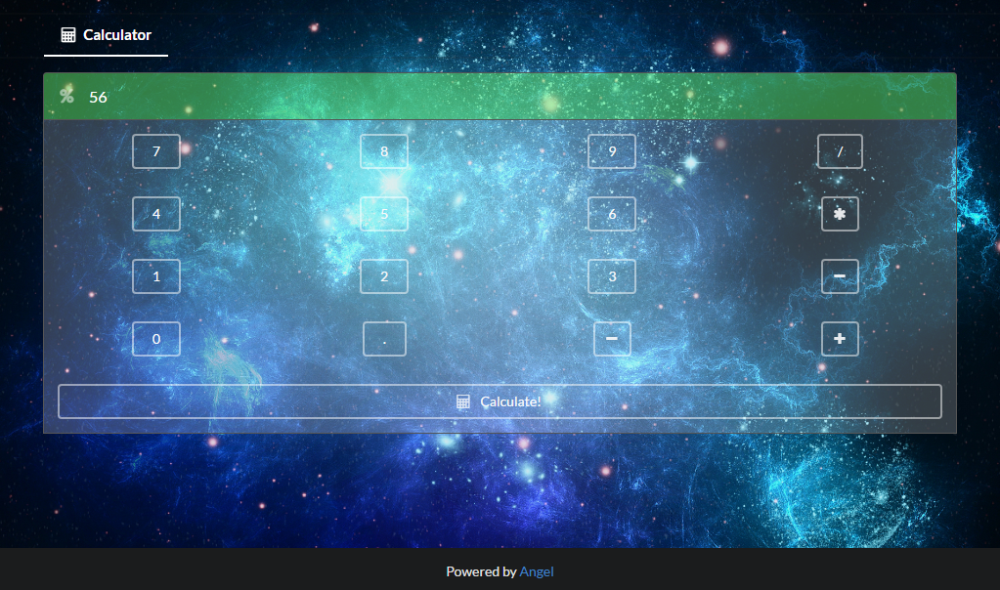

# angel_example
Huge Angel app that implements every single feature of the framework.
This is also a way to test the Angel framework for hidden bugs.

To start, run this command:

    dart bin/server.dart

The main server is a parent app that showcases the following features:
* `app.use`
* Static file serving via [angel_static](https://github.com/angel-dart/angel_static)
* Dynamic app configuration via [angel_configuration](https://github.com/angel-dart/angel_configuration)

It contains a few sub-apps:

* [Calculator](#calculator)

# Calculator

This is a Wolfram Alpha-esque Web app that showcases the following features:
* Controllers and `Expose`
* View rendering via [angel_mustache](https://github.com/angel-dart/angel_mustache)
* Middleware, and middleware use on controllers
* Throwing `AngelHttpExceptions`, and throwing them in middleware

It is a simple jQuery UI that evaluates math expressions via an Angel backend. The server
evaluates the expressions against an ANTLR calculator grammar.